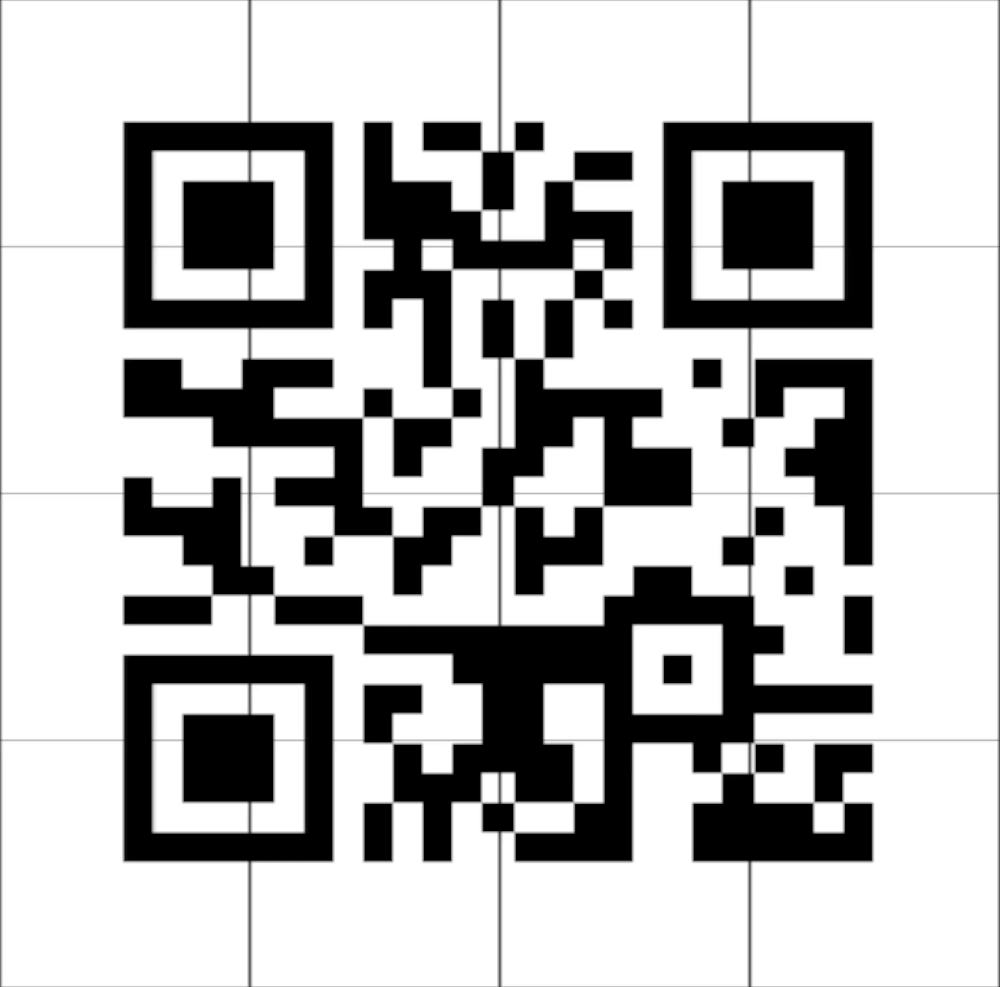

# Terms and Conditions May Apply

## Challenge
>There is a conspiracy theory called “Predictive Programming” that states that the Evil People in Charge (let’s call them “EPIC”) have made a deal with the Evil Boss (let’s call her “Lucy”) where they exchange their souls for power, fortune, and fame. However, the Good Boss (let’s call him “Josh”) doesn’t let the evil people just do whatever they want. Josh lets Lucy’s minions have some power, but they are required to warn their victims ahead of time of their nefarious plans.>
>
>Of course, Lucy thinks that’s just stupid. If she did that, no one would fall for them! So to get around the rule, Lucy and her EPIC acolytes communicate their evil plans to each other and to their unsuspecting victims through symbols (let’s call them “Sigils”). After all, it’s not THEIR fault if Mr. and Mrs. Johnny-Six-Pack don’t know what the symbol means, right? So they actively exploit the loophole in the contract.
>
>There is a video that is being discussed on Ghost Town that appears to have such a hidden message. Find the video and divine the meaning of the hidden message.
>
>Enter the flag like this: flag{secretmessage}.

## Solution

First step was finding this posting on Ghost Town https://ghosttown.deadface.io/t/predictive-programming/132/7 and the link to the video https://tinyurl.com/3fnvm89k

In the video, individual still images in black and white stand out. I have searched unsuccessfully for a simple video editing software that can recognise these scene changes and that I can operate in a short time. Instead I found a ffmpeg command and used it this way:

```shell
ffmpeg -i Lytton\ Labs\ Update\ Infomercial\ 1\ -\ VF.mp4 -vf select='gt(scene\,0.4)' -vsync vfr frame%d.png
```

This generated almost 80 images for me. Using Gwenview I deleted the images that were not part of the QR code and cut off the left and right edges of the ones that were part of the QR code: 


Then I used https://products.aspose.app/words/de/merger/png to combine the images first in rows and then to the complete QR Code:




The QR code corresponded to this URL https://files.lyttonlabs.org

```pre
flag{https://files.lyttonlabs.org}
```
