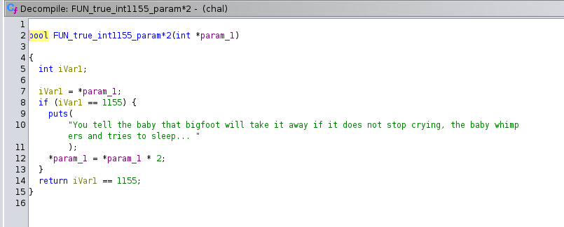

# Actually Baby Rev
> My baby doesn't stop crying. Could you please help me?

## Challenge
Together with this cry for help you get an archive [dist.zip](dist.zip) with a binary.

## Solution
After extracting the archive I opened the binary *chal* included in the archive with Ghidra and started to find my way through all the functions. There are multiple functions which take an input, compare the input and do a simple mathematical operation with the input (call by reference: the value changes also outside of the function). So I started renaming the functions like this one, which verifies if the input equals 1155 and then multiplies by two:



Other functions read the flag file, call setvbuf or contain the "logic of baby management" starting with this one:


To get to the call of *FUN_readflag()*, the three functions *FUN_input1_afterhappy()*, *FUN_input2_afterhungry()* and *FUN_input3_aftersleep()* all have to return the value 1. These three functions all look very similar, so let's start with the first function:


To increment the variable *local_3c* to 127 (a right click on 127 in Ghidra allows you to select the representation of this value in hex, octal or int, which is the most helpful one), 23 calls of the *FUN_void_param+5* function and 3 calls of the *FUN_void_param+4* function are needed, therefore your input should be *"55555555555555555555555999"* or any permutation thereof. On to the second function:


The smallest value for *local_1c* to fulfill all three modulo conditions is 31 and your input should be *"2444"* or any permutation thereof. On to the third function:


This is where naming the functions really helped, because now the order of the input was relevant. To start with the *FUN_ret1_paramset3*, the input should start with *8* and the next function to call is *FUN_true_int3_param\*7* and so on.

Putting it all together for a local test:

```console
echo "55555555555555555555555999\n2444\n80673" | ./chal
This baby does NOT stop crying. Please help I don't know what it wants!
Maybe we should try to make it happy
...
oops you forgot to burp the baby, the baby begins to burp: Flag file not found. If this is a local environment, include a flag.txt file in the same folder as your program
Otherwise, contact admin.
```

Finally send it to the server and find the flag in the output:
```console
nc actually-baby-rev.ctf.maplebacon.org 1337
...
oops you forgot to burp the baby, the baby begins to burp: maple{th3_b4by_cry1ng_1s_w0rs3_th4n_th1s_r3v3r51ng}.
```
